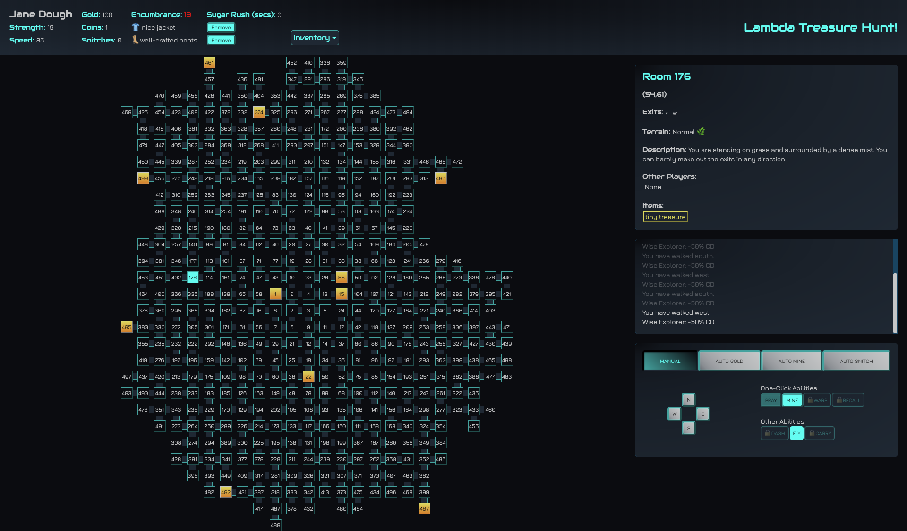

# Treasure-Hunt

Front End client built for interacting with the Lambda School Treasure Hunt server.

Project Specifications: [original repo](https://github.com/LambdaSchool/CS-Build-Week-2)

Live Site:
[https://ls-treasure-hunt-fe.herokuapp.com/](https://ls-treasure-hunt-fe.herokuapp.com/)

Video Presentation: [YouTube Link](https://youtu.be/GqxGJd4Cmx0)

## The Team

|                                          [May Ng](https://github.com/mngmay)                                           |                                          [Kevin Tou](https://github.com/KevinTou)                                          |                                              [Justine Lai](https://github.com/justinelai)                                              |
| :--------------------------------------------------------------------------------------------------------------------: | :------------------------------------------------------------------------------------------------------------------------: | :------------------------------------------------------------------------------------------------------------------------------------: |
|    |   |             |
|                                     |                                       |                                                 |
|  |  |  |

## Technologies Used

- [reactjs](https://reactjs.org/) - A JavaScript library for building user interfaces
  - [Context Api](https://reactjs.org/docs/context.html) - Context provides a way to pass data through the component tree without having to pass props down manually at every level
- [node-sass](https://www.npmjs.com/package/node-sass) - A library that provides binding for Node.js to LibSass, the C version of the popular stylesheet preprocessor, Sass.
- [axios](https://www.npmjs.com/package/axios) - Promise based HTTP client for the browser and node.js
- [react-router-dom](https://www.npmjs.com/package/react-router-dom) - DOM bindings for React Router
- [js-sha256](https://www.npmjs.com/package/js-sha256) - A simple SHA-256 / SHA-224 hash function for JavaScript supports UTF-8 encoding.

## Set up

Fork a copy of the project

Run `npm install` to install all dependencies needed for the project.

Create a `.env` file and set your API key to `REACT_APP_KEY=your-key-here`.

Run `npm start` to run the client.
